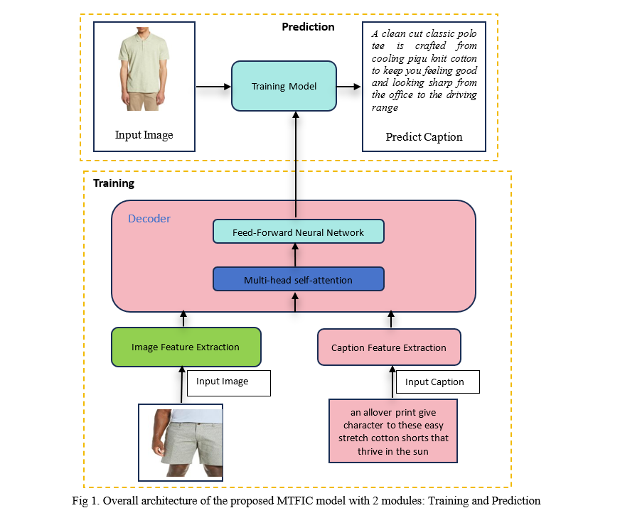

# **Introduction**
</br>

This is the source code of the published paper **EMTFIC: enhanced fashion image captioning via multi-transformer architecture with contrastive and bidirectional encodings on The Visual Computer Journal.**<br>
Link paper: https://doi.org/10.1007/s00371-025-04072-8 <br>

This repo contains some of the codes for this paper.



# **Dataset**

## FAshion CAptioning Dataset

**[FAshion CAptioning Dataset](https://doi.org/10.1007/978-3-030-58601-0_1), the fashion captioning dataset consisting of over 993K images.

</br>
<b><a href = "https://github.com/xuewyang/Fashion_Captioning"> Source of the dataset</a></b>
</br>

### Citation:

```
@inproceedings{XuewenECCV20Fashion,
Author = {Xuewen Yang and Heming Zhang and Di Jin and Yingru Liu and Chi-Hao Wu and Jianchao Tan and Dongliang Xie and Jue Wang and Xin Wang},
Title = {Fashion Captioning: Towards Generating Accurate Descriptions with Semantic Rewards},
booktitle = {ECCV},
Year = {2020}
}
```

## **Fashion-Gen**

**[Fashion-Gen datasets](https://arxiv.org/pdf/1806.08317)** consists of 293,008 high definition (1360 x 1360 pixels) fashion images paired with item descriptions provided by professional stylists.

```
@article{rostamzadeh2018fashion,
  title={Fashion-gen: The generative fashion dataset and challenge},
  author={Rostamzadeh, Negar and Hosseini, Seyedarian and Boquet, Thomas and Stokowiec, Wojciech and Zhang, Ying and Jauvin, Christian and Pal, Chris},
  journal={arXiv preprint arXiv:1806.08317},
  year={2018}
}
```

# Installation

Download the source code

```
git clone https://github.com/huyquoc22/ImageCaption
```

Install the package

```
pip install -r requirements.txt
```

# **Codes:**

To train the model, run:

```
cd src
python train.py
```

Once training is complete, run the following to evaluate the model on the test set:

```
python test.py
```

# Citation

```
Citation
```
